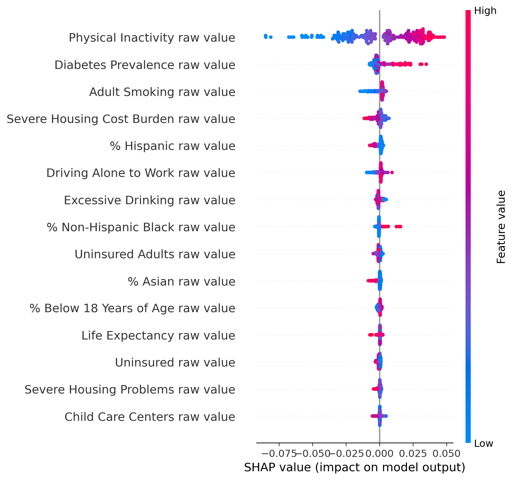
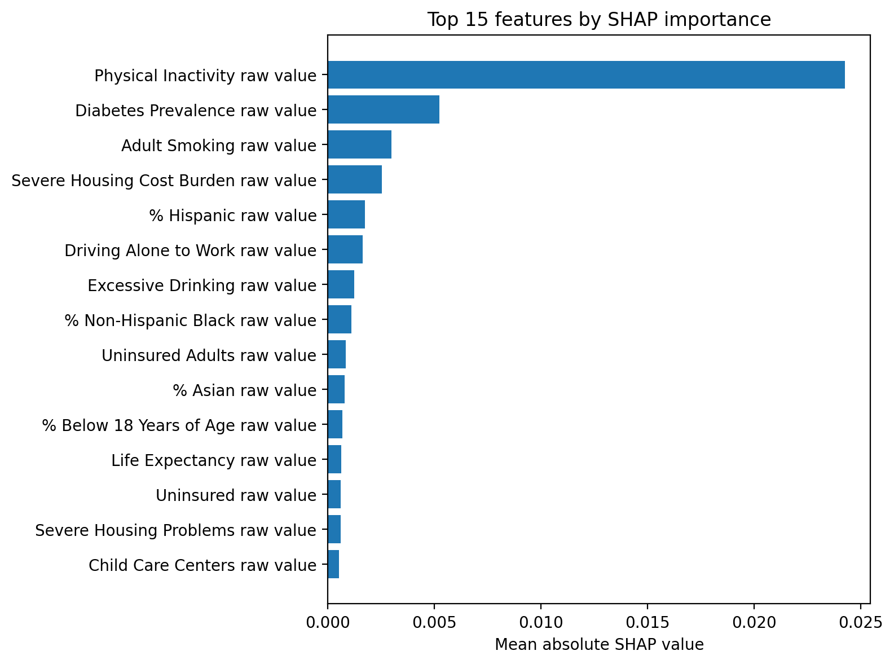

# What Drives Obesity in U.S. Counties?

### County Health Rankings 2025 Analysis

## Overview

This project analyzes county-level health data from the **2025 County Health Rankings (CHR)** dataset to identify the strongest predictors of **adult obesity prevalence** across the United States.

Using both **interpretable regression models** and **SHAP-based explainability**, the goal is to move beyond correlation and understand *which factors matter most*.

---

## Objective

* Build a predictive model for **adult obesity prevalence**
* Identify the **main contributing factors**
* Compare **linear coefficients vs. SHAP explanations**

---

## Dataset

* Source: County Health Rankings 2025
* Observations: ~3,000 U.S. counties
* Features: ~800 variables (health behaviors, clinical care, socioeconomic factors, environment)

### Data Processing

* Removed metadata rows
* Filtered to **county-level observations only**
* Used **“raw value” variables only** (excluded ranks & confidence intervals)
* Dropped features with >25% missingness
* Imputed remaining missing values (median)

---

## Methods

### Models

1. **ElasticNet Regression**

   * Scaled features
   * Provides interpretable coefficients
   * Handles multicollinearity

2. **Random Forest Regressor**

   * Captures nonlinear relationships
   * Used for feature importance via SHAP

---

### Explainability

* **Coefficients (ElasticNet)** → direction + magnitude
* **SHAP values (Random Forest)** → robust feature importance

---

## Results

### Model Performance

| Model         | R²    | RMSE   | MAE    |
| ------------- | ----- | ------ | ------ |
| **ElasticNet**| **~0.81** | **~0.020** | **~0.016** |
| XGBoost       | ~0.80 | ~0.021 | ~0.016 |
| Random Forest | ~0.78 | ~0.022 | ~0.017 |

*(Obesity is measured as a proportion, so RMSE ≈ 2 percentage points)*


### Additional Model: XGBoost
XGBoost was included as a performance benchmark. ElasticNet still slightly outperformed XGBoost, and the key drivers identified by SHAP remained consistent, reinforcing the robustness of the findings.


---

### Top Drivers of Obesity (SHAP)

1. Physical Inactivity
2. Diabetes Prevalence
3. Adult Smoking
4. Severe Housing Cost Burden
5. % Hispanic
6. Driving Alone to Work
7. Excessive Drinking
8. % Non-Hispanic Black
9. Uninsured Adults
10. % Asian

### Visualizations

* Each point represents a county.
* Color = feature value (red = high, blue = low)
* Position = impact on obesity prediction
* Features are ordered by overall importance.
* This plot shows that physical inactivity dominates all other predictors, with a much larger impact on obesity prevalence than any other variable.



The consistency between SHAP rankings and model performance suggests these drivers are robust across modeling approaches.


---

### Key Insight

> **Physical inactivity is the dominant predictor of obesity across U.S. counties**, with a substantially larger effect than any other variable.

Socioeconomic and environmental factors (housing cost burden, commuting patterns, insurance coverage) also play a significant role, suggesting that obesity is shaped by **structural conditions**, not just individual behavior.

---

## Project Structure

```
obesity-drivers-CHR2025/
├── data/
│   └── raw/
├── outputs/
│   ├── shap_summary.png
│   ├── shap_importance.csv
│   ├── elasticnet_coefficients.csv
│   └── model_metrics.csv
├── src/
│   ├── data_cleaning.py
│   ├── model.py
│   └── explain.py
├── main.py
├── requirements.txt
└── README.md
```

---

## How to Run

```bash
python -m venv .venv
source .venv/bin/activate   # macOS / Linux
pip install -r requirements.txt
python main.py
```

---

## Reproducibility

Running `main.py` will:

* clean the dataset
* train both models
* generate SHAP plots
* export feature importance and metrics

---

## Why SHAP over Coefficients?

While regression coefficients provide interpretability, they can be unstable due to **multicollinearity**.

SHAP values:

* handle nonlinear models
* provide consistent feature importance
* show both magnitude and direction of effects

---

## Limitations

* Observational data → no causal claims
* Strong correlation between health variables
* Some demographic variables may proxy for structural inequalities

---

## Future Work

* Add geographic visualization (county-level maps)
* Test causal inference approaches
* Compare with additional models (SVM, GAMs)

---

## TL;DR

> Obesity at the county level is driven most strongly by **physical inactivity**, with meaningful contributions from **chronic disease prevalence, health behaviors, and socioeconomic conditions**.
